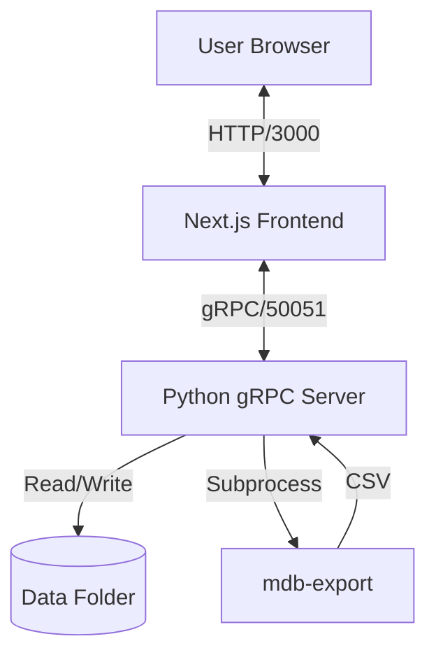

# System Architecture

## Overview
MeetManager Tools is a web-based application designed to parse, analyze, and visualize swimming meet data stored in Microsoft Access (`.mdb`) files suitable for Meet Manager.

## Tech Stack

### Frontend: Next.js (Web Client)
- **Framework**: [Next.js 15](https://nextjs.org/) (App Router)
- **Language**: TypeScript
- **Styling**: Tailwind CSS + Shadcn UI
- **Communication**: gRPC-web via `nice-grpc` and `grpc-web` proxy (or direct if Envoy is used, currently direct via Next.js server actions/client).
- **Location**: `./web-client`

### Backend: Python (Server)
- **Runtime**: Python 3.9+
- **Framework**: gRPC (AsyncIO)
- **Database Tools**: `mdbtools` for parsing `.mdb` files.
- **Data Persistence**: In-memory cache backed by file system (MDB/JSON).
- **Location**: `./backend`
- **Entry Point**: `src/server.py`

## Deployment (Docker)
The system is containerized using Docker Compose.

- **Backend Container**:
  - Builds from `./backend`
  - Mounts `./backend/data` for persistence.
  - Exposes port `50051`.
- **Frontend Container**:
  - Builds from `./web-client`
  - Exposes port `3000`.
  - Connects to backend via `backend:50051`.

## Data Flow Diagram

## Key Workflows

### 1. View Events
1. User navigates to `/events`.
2. Frontend calls `GetEvents()` gRPC method.
3. Backend reads `Event` table from active dataset.
4. Backend maps codes (e.g., "A", "F") to human-readable strings ("Freestyle", "Women").
5. Returns `EventList` protobuf message.

### 2. Upload Dataset
1. User uploads `.mdb` file in Admin Dashboard.
2. File streams to backend via `UploadDataset`.
3. Backend saves file to `data/` directory.
4. **Auto-Reload**: Backend detects active file update and refreshes in-memory cache.
5. Frontend shows success toast.

### 3. Entity Navigation
- **Athletes**: Detailed view at `/athletes/[id]`. joins Team data.
- **Teams**: Detailed view at `/teams/[id]`.

## Build & Release Pipeline
The project uses [`just`](https://github.com/casey/just) to manage the lifecycle of the application containers and local development.

### Common Commands
- **`just verify`**: **(Recommended)** Runs the full verification pipeline: Lint -> Test.
- **`just build`**: Rebuilds Docker containers from the root context.
- **`just codegen`**: Regenerates gRPC Python and TypeScript code from the root `protos/` directory.
- **`just clean`**: Safely removes cache artifacts (`.DS_Store`, `__pycache__`, `.next`).

### Workflow Steps
1. **Contract Definition**: Protos are stored in `/protos` and shared by both services.
2. **Hermetic Build**: Docker containers use the root directory as their build context, ensuring all shared assets are available during `docker build`.
3. **Dependency Management**:
   - **Backend**: Managed via `uv` in `backend/pyproject.toml`.
   - **Frontend**: Managed via `npm` in `web-client/package.json`.
4. **Verification**: 
   - **Linting**: Uses `ruff` for Python and `biome`/`eslint` for TypeScript.
   - **Testing**: Uses `pytest` (Backend) and `Vitest` (Frontend).

### Troubleshooting
- **Permission Errors**: If you see errors deleting `__pycache__` or `.uv_cache`, you may need to run `sudo rm -rf ...` once to clear old root-owned artifacts. The new build process prevents them from recurring.
- **Docker Build Stall**: If "Sending build context" takes too long, check that `web-client/node_modules` and `.git` are properly ignored in `.dockerignore`.
