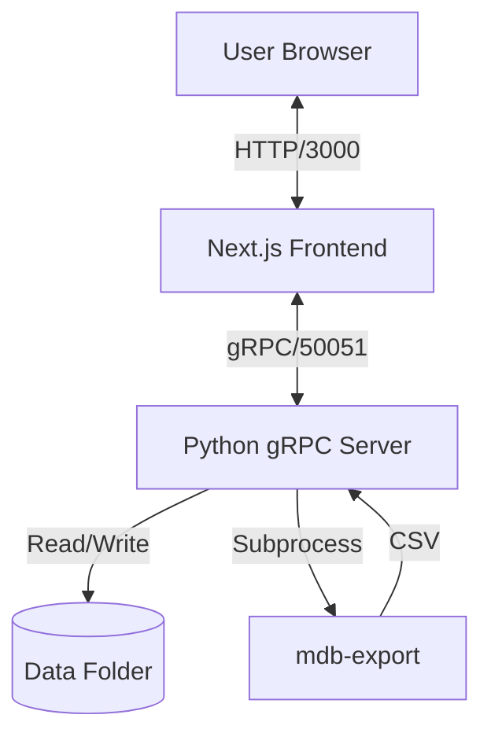

# System Architecture

## Overview
MeetManager Tools is a web-based application designed to parse, analyze, and visualize swimming meet data stored in Microsoft Access (`.mdb`) files suitable for Meet Manager.

## Tech Stack

### Frontend: Next.js (Web Client)
- **Framework**: [Next.js 15](https://nextjs.org/) (App Router)
- **Language**: TypeScript
- **Styling**: Tailwind CSS + Shadcn UI
- **Communication**: gRPC-web via `nice-grpc` and `grpc-web` proxy (or direct if Envoy is used, currently direct via Next.js server actions/client).
- **Location**: `./web-client`

### Backend: Python (Server)
- **Runtime**: Python 3.9+
- **Framework**: gRPC (AsyncIO)
- **Database Tools**: `mdbtools` for parsing `.mdb` files.
- **Data Persistence**: In-memory cache backed by file system (MDB/JSON).
- **Location**: `./backend`
- **Entry Point**: `src/server.py`

## Deployment (Docker)
The system is containerized using Docker Compose.

- **Backend Container**:
  - Builds from `./backend`
  - Mounts `./backend/data` for persistence.
  - Exposes port `50051`.
- **Frontend Container**:
  - Builds from `./web-client`
  - Exposes port `3000`.
  - Connects to backend via `backend:50051`.

## Data Flow Diagram

## Key Workflows

### 1. View Events
1. User navigates to `/events`.
2. Frontend calls `GetEvents()` gRPC method.
3. Backend reads `Event` table from active dataset.
4. Backend maps codes (e.g., "A", "F") to human-readable strings ("Freestyle", "Women").
5. Returns `EventList` protobuf message.

### 2. Upload Dataset
1. User uploads `.mdb` file in Admin Dashboard.
2. File streams to backend via `UploadDataset`.
3. Backend saves file to `data/` directory.
4. **Auto-Reload**: Backend detects active file update and refreshes in-memory cache.
5. Frontend shows success toast.

### 3. Entity Navigation
- **Athletes**: Detailed view at `/athletes/[id]`. joins Team data.
- **Teams**: Detailed view at `/teams/[id]`.
