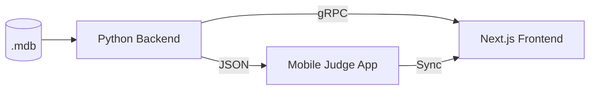

# MMTools System Architecture

This is the central entry point for understanding the MMTools technical architecture.

## 🚀 Quick Start Guide

MMTools is a decoupled suite of applications communicating via **gRPC**.

### Core Components
- **Frontend (`/web-client`)**: Next.js 15 (App Router). Primary interface for Meet Directors.
- **Backend (`/backend`)**: Python gRPC server. Legacy `.mdb` parsing and PDF generation.
- **Mobile App (`/mobile-judge-app`)**: React Native/Expo. Offline-first DQ recording for judges.
- **Protos (`/protos`)**: Shared Protocol Buffer definitions.

### Data Flow Overview

```mermaid
graph LR
    MDB[(.mdb)] --> BE[Python Backend]
    BE -->|gRPC| FE[Next.js Frontend]
    BE -->|JSON| MA[Mobile Judge App]
    MA -->|Sync| FE
```

## 📚 Detailed Documentation

For an in-depth look at our design decisions, tradeoffs, and internal logic, please refer to the **[Comprehensive Architecture Guide](docs/ARCHITECTURE_COMPREHENSIVE.md)**.

### Key Deep Dives in the Comprehensive Guide:
- **Information Flow**: How we parse `.mdb` files using **Jackcess**.
- **State Management**: Why we use **Firestore** for persistent job tracking in serverless environments.
- **Mobile Sync**: Details on the **Offline-First** queue and QR-code initialization.
- **Reporting Engine**: Tradeoffs between **WeasyPrint** and **Playwright (Chromium)**.
- **Security**: The user-sandboxing model and Firebase Auth integration.

## 🛠️ Development Tools
We use `just` for task orchestration.
- `just build`: Build all services via Docker.
- `just verify`: Run all linting and tests.
- `just codegen`: Regenerate gRPC code from protos.
