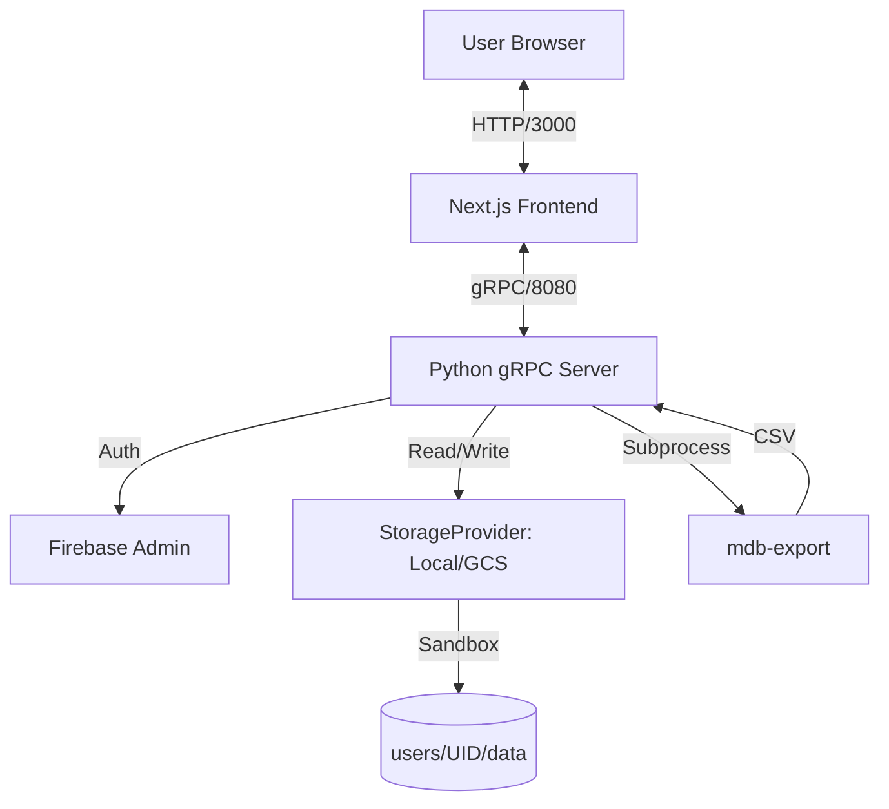

# System Architecture

## Overview
MeetManager Tools is a web-based application designed to parse, analyze, and visualize swimming meet data stored in Microsoft Access (`.mdb`) files suitable for Meet Manager.

## Tech Stack

### Frontend: Next.js (Web Client)
- **Framework**: [Next.js 15](https://nextjs.org/) (App Router)
- **Language**: TypeScript
- **Authentication**: Firebase SDK (Google Login)
- **Styling**: Tailwind CSS + Shadcn UI
- **Communication**: gRPC-web via `nice-grpc` with a custom auth middleware to inject Bearer tokens.
- **Location**: `./web-client`

### Backend: Python (Server)
- **Runtime**: Python 3.11+
- **Framework**: gRPC (Sync with Interceptors)
- **Authentication**: `firebase-admin` for verifying ID tokens.
- **Database Tools**: `mdbtools` for parsing `.mdb` files.
- **Storage Layer**: Abstract `StorageProvider` supporting `LocalStorage` and `GCSStorage`.
- **Location**: `./backend`
- **Entry Point**: `src/server.py`

## Deployment (Docker)
The system is containerized and cloud-ready for Google Cloud Run.

- **Backend Container**:
  - Builds from `./backend`
  - Uses `StorageProvider` for persistence (Local or GCS).
  - Exposes port `8080` (normalized for Cloud Run).
- **Frontend Container**:
  - Builds from `./web-client`
  - Exposes port `3000`.
  - Connects to backend via `BACKEND_INTERNAL_HOST`.

## Data Flow Diagram

```mermaid
graph TD
    User[User Browser] <-->|HTTP/3000| Frontend[Next.js Frontend]
    Frontend <-->|gRPC/8080| Backend[Python gRPC Server]
    Backend -->|Auth| Firebase[Firebase Admin]
    Backend -->|Read/Write| Storage[StorageProvider: Local/GCS]
    Storage -->|Sandbox| Users[(users/UID/data)]
    Backend -->|Subprocess| MdbTools[mdb-export]
    MdbTools -->|CSV| Backend
```

## Key Workflows

### 1. Multi-User Authentication
1. User logs in via Google on the Frontend.
2. Firebase provides an ID token.
3. Every gRPC call includes `Authorization: Bearer <token>`.
4. Backend `FirebaseAuthInterceptor` verifies the token and injects `uid` into the request context.

### 2. User-Sandboxed Storage
1. Data is isolated using the user's unique ID (`uid`).
2. `StorageProvider` maps requests to paths like `users/[UID]/filename.mdb`.
3. Operations like `UploadDataset`, `ListDatasets`, and `GetScores` only access the authenticated user's sandbox.

### 3. Entity Navigation
- **Athletes**: Detailed view at `/athletes/[id]`. joins Team data.
- **Teams**: Detailed view at `/teams/[id]`.

### 4. Reporting Engine
- **Extractor**: `ReportDataExtractor` transforms hierarchical MDB data into report-ready structures with support for gender and age filtering.
- **Bundling**: `GenerateReportBundle` utilizes `zipfile` to package multiple rendered reports into a single ZIP archive.
- **Renderer**: WeasyPrint-based engine with Jinja2 templates (auto-escape enabled for security).

## Build & Release Pipeline
The project uses [`just`](https://github.com/casey/just) to manage the lifecycle of the application containers and local development.

### Common Commands
- **`just verify`**: Runs the full local verification pipeline: Lint -> Test.
- **`just verify-ci`**: **(Recommended before PR)** Runs the full pipeline in a clean Docker container mirroring the production environment.
- **`just ci-local`**: Uses `act` to execute GitHub Actions workflows locally.
- **`just build`**: Rebuilds Docker containers from the root context.
- **`just codegen`**: Regenerates gRPC Python and TypeScript code from the root `protos/` directory.
- **`just clean`**: Safely removes cache artifacts (`.DS_Store`, `__pycache__`, `.next`).

### Workflow Steps
1. **Contract Definition**: Protos are stored in `/protos` and shared by both services.
2. **Hermetic Build**: Docker containers use the root directory as their build context, ensuring all shared assets are available during `docker build`.
3. **Dependency Management**:
   - **Backend**: Managed via `uv` in `backend/pyproject.toml`.
   - **Frontend**: Managed via `npm` in `web-client/package.json`.
4. **Verification**: 
   - **Linting**: Uses `ruff` for Python and `biome`/`eslint` for TypeScript.
   - **Testing**: Uses `pytest` (Backend) and `Vitest` (Frontend).

### Troubleshooting
- **Permission Errors**: If you see errors deleting `__pycache__` or `.uv_cache`, you may need to run `sudo rm -rf ...` once to clear old root-owned artifacts. The new build process prevents them from recurring.
- **Docker Build Stall**: If "Sending build context" takes too long, check that `web-client/node_modules` and `.git` are properly ignored in `.dockerignore`.
