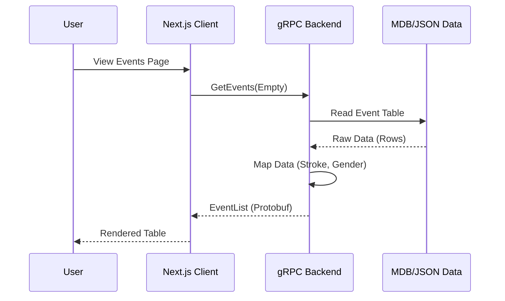

# Architecture Overview

The MeetManager Tools project is a modern web application for managing and viewing swimming meet data. It consists of a Next.js frontend and a Python gRPC backend.

## key Components

### Frontend (Web Client)
- **Framework**: Next.js 15 (App Router)
- **Language**: TypeScript
- **Styling**: Tailwind CSS
- **Communication**: gRPC-web (via `nice-grpc`)
- **State**: React Server Components (RSC) and Client Components.

### Backend (Server)
- **Framework**: Python gRPC
- **Data Source**: `.mdb` (Microsoft Access) files or converted `.json`.
- **Tools**: `mdbtools` for parsing MDB files.

## Data Flow

## Entity Relationships
The core entities are:
- **Meets**: The competition event.
- **Sessions**: Time blocks within a meet.
- **Teams**: Participating clubs.
- **Athletes**: Swimmers assigned to teams.
- **Events**: Races (e.g., "Boys 100 Free").
- **Entries**: Link between Athlete and Event.

## Navigation
- Users can navigate from lists (Entries, Results) to Entity Detail pages (Athlete Profile, Team View).
- Uploading a new MDB file triggers an immediate reload of the backend cache.
