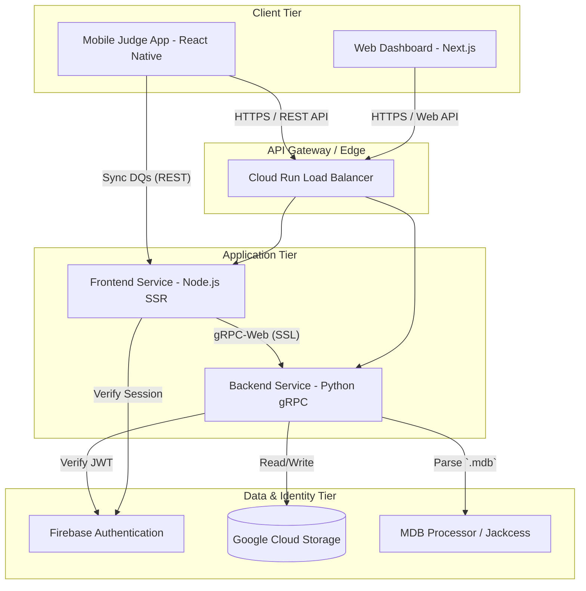

# MMTools Comprehensive Architecture Guide

## 1. Executive Summary

MMTools (formerly MeetManager Tools) is a modern, cloud-native suite of applications designed to augment and streamline the process of managing swimming meets. It bridges the gap between legacy, on-premise Meet Manager database formats (`.mdb`) and modern web and mobile ecosystems. By taking a monolithic desktop-bound process and extending it to the cloud, MMTools enables multi-user collaboration, real-time data dissemination, and specialized volunteer applications—such as the Stroke & Turn Judge mobile app.

This document serves as the comprehensive architectural reference for the MMTools project, detailing the high-level system design, the distinct components, their interactions, deployment strategies, and the security model.

## 2. High-Level System Architecture

At its core, MMTools utilizes a decoupled client-server architecture communicating via gRPC. 

### 2.1. Core Components
The system is divided into four primary logical components:

1.  **Frontend (Web Client)**: A Next.js (React) web application serving as the primary interface for Meet Directors and computer team operators. It allows users to upload data, view dashboards, and generate PDF reports.
2.  **Backend (Python gRPC Server)**: A Python-based server that ingests `.mdb` files, processes swim meet logic, handles PDF generation via WeasyPrint, and serves data via gRPC.
3.  **Mobile Judge App (React Native/Expo)**: A dedicated Offline-First progressive web app (PWA) / mobile application used by Stroke & Turn Judges on the pool deck to record disqualifications (DQs) and sync them back to the server.
4.  **Cloud Infrastructure & Storage**: Managed by Terraform, leveraging Google Cloud Run for compute, Google Cloud Storage (GCS) for isolated user data, and Firebase Authentication for identity management.

### 2.2. Component Interaction Diagram

## 3. Frontend Architecture (Web Client)

The Frontend is built using Next.js 15 utilizing the App Router paradigm. It emphasizes a mix of Server-Side Rendering (SSR) for initial load performance and Client-Side rendering for interactive dashboards.

### 3.1. Technology Stack
- **Framework**: Next.js 15 (React)
- **Styling**: Tailwind CSS v4, integrated with Shadcn/UI for accessible component primitives.
- **State Management**: React Hooks (Context API for global state, such as Authentication).
- **Communication**: `nice-grpc` and `grpc-web` for communicating with the Python backend.

### 3.2. Authentication Flow (Frontend)
The Web Client enforces authentication via an `AuthGuard` component wrapping the main application layout.
1.  User accesses a protected route.
2.  `AuthGuard` checks the Firebase Auth state via `onAuthStateChanged`.
3.  If unauthenticated, the user is redirected to `/login`.
4.  On the `/login` page, the user authenticates via Google OAuth using `signInWithPopup`.
5.  Upon success, the Firebase client SDK retrieves an ID token.
6.  The token is stored in a secure cookie (`js-cookie`) and automatically injected into all subsequent gRPC calls via a custom `nice-grpc` middleware.

### 3.3. API Routes as Proxies
While gRPC-Web can be called directly from the browser, certain operations—specifically those originating from the Mobile Judge App which lacks gRPC capabilities—are routed through Next.js Route Handlers (`app/api/...`).
- **`/api/sync-dqs`**: Receives REST POST requests from the Mobile App containing DQ JSON data, translates them, and forwards them to the backend via the `SyncDQs` gRPC method.
- **`/api/data`**: Fetches generated JSON program files from the backend via the `GetFile` gRPC method to serve to the Mobile App during the initial "Publish" sync.

### 3.4. Deep Navigation & Filtering Consistency
The Web Client relies on URL query parameters to maintain state across pages, avoiding complex global state management where possible.
- **State Propagation**: When navigating from summary pages (like Events) to detail pages (like Entries or Relays), the `?event=[ID]` parameter is passed in the URL.
- **Backend Responsibility**: The backend gRPC handlers (e.g., `GetEntries`, `GetRelays`) are responsible for honoring these filters. If a filter parameter is omitted, invalid, or zero, the backend MUST default to returning all data. This ensures direct links (deep navigation) remain functional without requiring prior user interaction.

## 4. Backend Architecture (Python gRPC Server)

The Backend is a specialized Python service designed to handle the heavy lifting of parsing legacy Microsoft Access databases (`.mdb`) and generating complex, paginated PDF reports.

### 4.1. Technology Stack
- **Language**: Python 3.11+
- **API Framework**: `grpcio` and `grpcio-tools`
- **Data Processing**: `pandas` and custom extraction logic.
- **Database Parsing**: `jpype` and the Java-based `Jackcess` library. (Provides vastly superior performance compared to CLI wrappers like `mdbtools`).
- **PDF Generation**: `WeasyPrint`, generating high-quality PDFs from Jinja2 HTML templates.

### 4.2. MDB Ingestion Pipeline
The ingestion of an `.mdb` file is a critical, performance-sensitive operation.
1.  The Web Client uploads chunks of the `.mdb` file via a streaming gRPC call (`UploadDataset`).
2.  The backend reassembles the file into a secure, user-specific temporary location on Google Cloud Storage.
3.  The `MmToJsonConverter` class initializes a JVM instance via `jpype` and uses the `Jackcess` library to parse the raw Access database tables.
4.  Data is extracted, normalized (handling various legacy casing conventions), and cached as JSON to prevent redundant, expensive parsing on subsequent requests.

### 4.3. gRPC Service Design
The `MeetManagerService` defines the contract between the frontend and backend. It utilizes Protocol Buffers (protobuf v3) to ensure strict type safety across the network boundary.
- **Interceptors**: A custom `FirebaseAuthInterceptor` sits in front of all RPC methods. It intercepts the incoming call, extracts the `Authorization: Bearer <token>` metadata, verifies the token with the Firebase Admin SDK, and injects the resolved `uid` into the context.

### 4.4. Storage Abstraction Layer
To support both seamless local development and robust cloud deployment, the backend implements a `StorageProvider` interface.
- **`LocalStorageProvider`**: Writes to the local filesystem (used when running locally via Docker Compose).
- **`GCSStorageProvider`**: Interacts with the Google Cloud Storage API.
- **Sandboxing**: The backend enforces a strict `users/{uid}/` prefix on all storage operations. This guarantees that User A can never accidentally or maliciously access User B's uploaded `.mdb` files, generated JSONs, or DQs.

## 5. Cloud Infrastructure & Deployment

MMTools is deployed to Google Cloud Platform (GCP) using an automated, Infrastructure-as-Code approach.

### 5.1. Terraform Configuration (`deploy/`)
Terraform defines the desired state of the cloud resources:
- **Google Cloud Run**: Two services are provisioned (`mmtools-frontend` and `mmtools-backend`). Cloud Run provides auto-scaling, scaling down to zero when idle to save costs, and scaling up to handle concurrent report generation bursts.
- **Google Cloud Storage (GCS)**: A single, globally unique bucket (`mmtools-data-[PROJECT_ID]`) is provisioned to hold all user datasets.
- **Artifact Registry**: A Docker repository (`mmtools`) stores the built container images.
- **IAM Policies**: A dedicated service account (`mmtools-runner`) is created with least-privilege access, granted only the `roles/storage.objectAdmin` role for the specific GCS bucket. Both Cloud Run services run under this identity.

### 5.2. Continuous Integration & Continuous Deployment (CI/CD)
GitHub Actions powers the CI/CD pipeline.
1.  **CI (`ci.yml`)**: On every Pull Request, the code is linted (Biome for TS, Ruff for Python), type-checked (Mypy), and subjected to a suite of headless integration tests simulating core user journeys within an isolated Docker environment.
2.  **CD (`deploy-cloud-run.yml`)**: On pushes to the `main` branch, the pipeline:
    - Authenticates to GCP via Workload Identity Federation or a Service Account JSON key.
    - Builds the backend Docker image and pushes it to Artifact Registry.
    - Builds the frontend Docker image, injecting Firebase environment variables via `--build-arg` to ensure they are baked into the static Next.js bundle.
    - Deploys both images to Cloud Run, dynamically routing the frontend to the newly generated backend URL.

## 6. Mobile Judge Application

The Mobile Judge App is a specialized satellite application. Its architecture is dictated by the unique constraints of a swimming pool deck: poor Wi-Fi and the need for absolute reliability.

### 6.1. Technology Stack
- **Framework**: React Native + Expo (Managed Workflow)
- **Deployment target**: Exported as an Expo Web application (PWA) hosted on GitHub Pages.
- **State Management**: Local component state and persistent Offline Queues using browser `localStorage` or React Native `AsyncStorage`.

### 6.2. The "Publish and Sync" Workflow
1.  **Publishing**: The Meet Director (on the Web Client) clicks "Publish". The backend generates a highly optimized JSON file containing only the events, heats, and swimmer data needed for the current session. This JSON is saved to a public GCS URL.
2.  **QR Code Initialization**: A QR code is generated containing a deeply linked URL to the Judge App, embedding the `program_url` and the `sync_url`.
3.  **Offline Operation**: The Judge scans the QR code. The app downloads the JSON payload once. The Judge can now operate entirely offline. When a DQ is recorded, it is stored in an internal "Offline Queue".
4.  **Synchronization**: When the Judge regains network connectivity, they tap "Sync". The app POSTs the queued DQs to the `sync_url` (the Next.js API route), where they are forwarded to the backend and safely stored in the Meet Director's GCS sandbox.

## 7. Development Environment & Performance Considerations

Local development is orchestrated via Docker Compose and a `Justfile`, ensuring parity with the production cloud environment while optimizing for the developer experience on macOS.

### 7.1. macOS File Locking & Colima
Running Docker on macOS (often via Colima or Docker Desktop) introduces severe filesystem bridging overhead. 
- **The Problem**: Mounting high-churn directories like `node_modules` or Python's `__pycache__` across the virtualization boundary causes the host machine's Git operations to stall (scanning 70,000+ files) and can cause `OSError: Resource deadlock avoided` when Python attempts to write `.pyc` files.
- **The Solution**: 
  - `PYTHONDONTWRITEBYTECODE=1` is set in the backend environment.
  - **Anonymous Volumes**: The `docker-compose.yml` utilizes "hole punching". It mounts the source code (`- ./web-client:/app`) but then explicitly defines anonymous volumes for the noisy directories (`- /app/node_modules`). This forces the heavy I/O to remain entirely within the fast Linux VM, shielding the macOS host and keeping Git operations lightning fast.

### 7.2. Concurrent Workspace Safety
To support multiple developers (or AI agents) working on the same physical machine:
- The `.env` file uses `COMPOSE_PROJECT_NAME` to namespace Docker networks and containers.
- Dynamic port mapping (`FRONTEND_PORT`, `BACKEND_PORT`) prevents port collision conflicts when spinning up multiple instances of the application stack.

## 8. Security Summary

- **Transport**: All inter-service communication (Frontend -> Backend) and client-server communication occurs over SSL/TLS (HTTPS/gRPC-SSL).
- **Identity**: Delegated entirely to Google Identity Platform via Firebase. No passwords are stored or managed by MMTools.
- **Data Isolation**: Strict server-side enforcement of user IDs in all storage path constructions.
- **Path Traversal Protection**: Backend file handlers utilize `os.path.basename()` and strict directory anchoring to prevent malicious path injection (`../`).
- **Least Privilege**: Cloud Run instances operate under a dedicated service account that only possesses access to the specific data bucket, mitigating the blast radius of any potential RCE vulnerability.