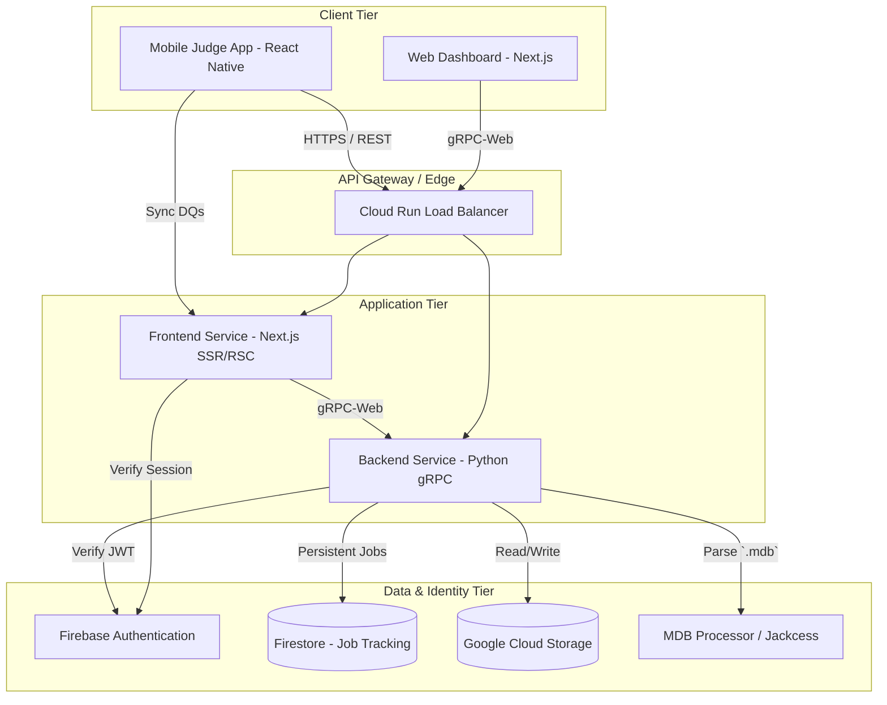

# MMTools Comprehensive Architecture Guide

## 1. Executive Summary

MMTools (formerly MeetManager Tools) is a modern, cloud-native suite of applications designed to augment and streamline the process of managing swimming meets. It bridges the gap between legacy, on-premise Meet Manager database formats (`.mdb`) and modern web and mobile ecosystems. By taking a monolithic desktop-bound process and extending it to the cloud, MMTools enables multi-user collaboration, real-time data dissemination, and specialized volunteer applications—such as the Stroke & Turn Judge mobile app.

## 2. High-Level System Architecture

MMTools utilizes a decoupled client-server architecture communicating primarily via gRPC.

### 2.1. Component Interaction Diagram

## 3. Information Flow

The path from raw legacy data to a functional UI follows a strictly defined pipeline:

1.  **Ingestion (.mdb)**: The user uploads a Microsoft Access `.mdb` file via the Web Client.
2.  **Parsing (Jackcess)**: The Backend reassembles the file and uses the Java-based **Jackcess** library (via `jpype`) to parse the legacy binary format. This is significantly faster and more reliable than traditional ODBC or CLI-based drivers.
3.  **Normalization (Python)**: Raw database tables are mapped into typed Python objects. Data is normalized (e.g., handling inconsistent casing in names) and cached as optimized JSON.
4.  **Distribution (gRPC)**: Data is served via gRPC. High-performance Protocol Buffers ensure type safety and low latency between the Backend and Frontend.
5.  **Consumption (Next.js/UI)**: 
    *   **Web Client**: Uses React Server Components (RSC) for data fetching or Client Components with `nice-grpc` for interactive elements.
    *   **Mobile App**: Fetches a pre-processed "Program JSON" from a signed GCS URL for offline usage.

## 4. State Management & Persistence Tradeoffs

MMTools manages two types of state: **Long-term Data** (Datasets) and **Transient Task State** (Background Jobs).

### 4.1. Firestore vs. In-memory
For background job tracking (e.g., PDF generation progress):
-   **In-Memory (Local Dev)**: Used during local development for simplicity. State is lost if the server restarts.
-   **Firestore (Production)**: In Cloud Run, instances are stateless and can rotate or scale to zero. **Firestore** is used to persist job status (`job_id`, `progress`, `status`). 
-   **Tradeoff**: Firestore provides the necessary persistence for a serverless environment, ensuring that a user can poll for a 2-minute PDF generation task even if the specific container instance that started the task has been replaced.

## 5. Reporting Engine Tradeoffs

MMTools supports two distinct PDF rendering engines to balance quality and performance.

### 5.1. WeasyPrint vs. Playwright
-   **WeasyPrint (Native Python)**: 
    *   *Pros*: Lightweight, standard Python library, handles complex CSS/Jinja2 templates well.
    *   *Cons*: Slower for massive datasets (championship meets).
-   **Playwright (Chromium-based)**:
    *   *Pros*: 2-4x faster rendering by leveraging the Chromium engine. Ideal for high-volume report generation.
    *   *Cons*: Requires a full browser installation in the Docker container, significantly increasing image size (~500MB+).
-   **Tradeoff**: The system defaults to WeasyPrint for standard operations but can leverage the `PlaywrightRenderer` for performance-critical batches.

## 6. Mobile Judge App: Offline-First Strategy

The Mobile Judge App is designed for the pool deck, where network connectivity is often intermittent.

### 6.1. Synchronization Logic
1.  **Initialization (QR Code)**: The Meet Director generates a QR code containing the `program_url` (data source) and `sync_url` (destination).
2.  **Offline Cache**: The app downloads the session program once and stores it in a local database (SQLite on native, `localStorage` on web).
3.  **Offline Queue**: Recorded DQs are stored locally with a `sync_status = "pending"`.
4.  **Idempotent Sync**: When connectivity is detected (via `NetInfo`), the app attempts to sync. It uses **Stable IDs** (`dq-{event}-{swimmer}-{leg}`) to ensure that multiple sync attempts of the same DQ do not create duplicates.

## 7. Security Model

-   **Identity**: Managed via Firebase Authentication (Google Login).
-   **Sandboxing**: All storage operations are prefixed with the user's `uid` (`users/{uid}/...`). This ensures strict data isolation at the storage layer.
-   **Interceptors**: Backend gRPC calls are guarded by a `FirebaseAuthInterceptor` that validates JWTs on every request.
-   **Least Privilege**: Cloud Run services operate under a service account with restricted access only to the necessary GCS buckets.

## 8. Development & Deployment

-   **Containerization**: Both services are Dockerized. The frontend uses `--build-arg` to bake Firebase config into the static bundle.
-   **macOS Optimization**: In Docker Compose, anonymous volumes are used for `node_modules` and `__pycache__` to prevent "Resource Deadlock" and filesystem slowness on macOS hosts.
-   **Infrastructure as Code**: Managed via Terraform in the `deploy/` directory.
