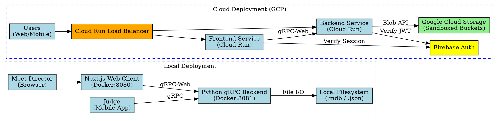
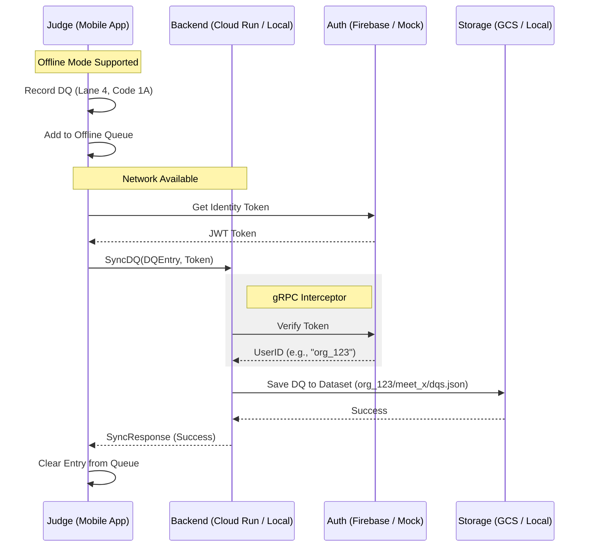

# System Diagrams

This document contains the architecture and interaction diagrams for the MeetManager-Tools project, covering both local and cloud deployment scenarios.

## 1. System Architecture

The following diagram illustrates the components and data flow for both local (Docker-based) and cloud (GCP Cloud Run) environments.

## 2. Core Interaction: DQ Entry (Sync)

This sequence diagram shows how a DQ entry is recorded in the mobile app and synchronized with the backend, including authentication and user-sandboxed storage.

